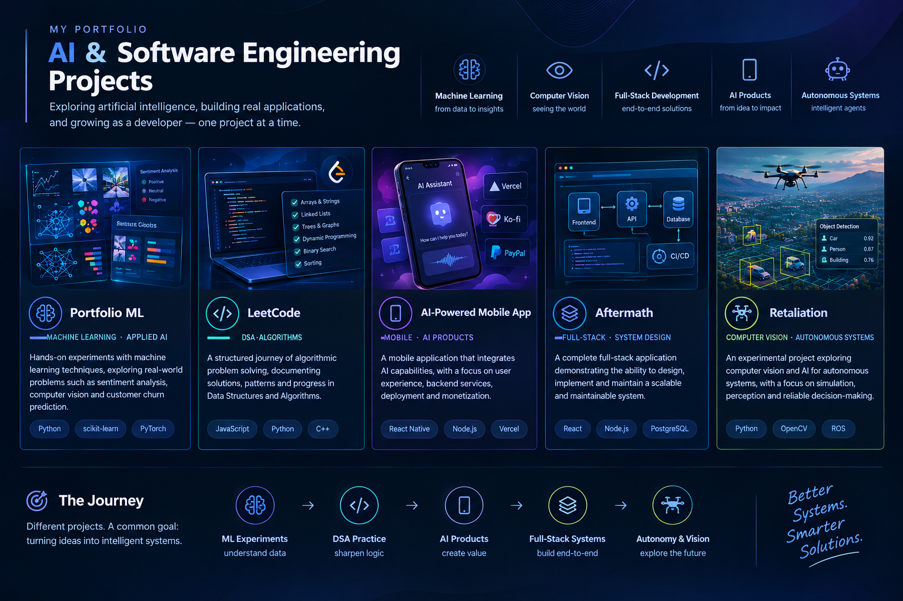

# Hi, I'm ProximaRenovatio 👋

### AI · Machine Learning · Software Engineering

I'm building a portfolio focused on **Artificial Intelligence, Machine Learning, and Software Engineering**, combining technical experimentation with practical application development.

My goal is to develop a strong foundation in AI while learning to design, build, and deploy complete software systems — from algorithmic problem-solving to AI-powered products and computer vision applications.

This profile serves as a central index of my projects, experiments, and technical progress.

---

## 🗺️ Portfolio Overview

My projects explore different aspects of AI and software engineering, from fundamental algorithms to intelligent applications and autonomous systems.

## 📂 Project Index

| Project                                                              | Focus                                | Objective                                                                           |
| -------------------------------------------------------------------- | ------------------------------------ | ----------------------------------------------------------------------------------- |
| [Portfolio ML](#-01-portfolio-ml)                                    | Machine Learning · Applied AI        | Experiment with sentiment analysis, computer vision, and customer churn prediction. |
| [LeetCode](#-02-leetcode--dsa--problem-solving)                      | DSA · Algorithms                     | Track problem-solving progress and develop algorithmic thinking.                    |
| [AI-Powered Mobile App](#-03-ai-powered-mobile-app)                  | Mobile · AI Products                 | Build an AI-powered application and explore deployment and monetization.            |
| [Aftermath](#-04-aftermath--full-stack-project)                      | Full-Stack · System Design           | Design and implement a complete, maintainable software application.                 |
| [Retaliation](#-05-retaliation--computer-vision--autonomous-systems) | Computer Vision · Autonomous Systems | Explore AI-driven perception and autonomy through controlled experiments.           |

---

## 🧠 01. Portfolio ML

**Focus:** Machine Learning · Applied AI · Data Science

A collection of practical machine learning experiments exploring different problems, techniques, and evaluation methods.

### Planned experiments

* **Sentiment Analysis:** classify sentiment in text reviews.
* **Computer Vision:** experiment with image analysis and visual recognition.
* **Customer Churn Prediction:** identify patterns associated with customer attrition.

Each experiment will aim to document the problem, dataset, preprocessing, methodology, evaluation metrics, results, and limitations.

**Objective:** Develop a solid understanding of the end-to-end machine learning workflow, from data exploration to model evaluation.

[→ Explore repository](https://github.com/ProximaRenovatio/ai-ml-portfolio)

---

## 💻 02. LeetCode — DSA & Problem Solving

**Focus:** Data Structures · Algorithms · Computational Thinking

A structured record of my algorithmic problem-solving journey, documenting solutions, patterns, and improvements over time.

### Areas of focus

* Arrays, strings, and hash maps
* Linked lists, stacks, and queues
* Trees, graphs, and recursion
* Sorting, binary search, and dynamic programming
* Time and space complexity analysis

The repository will track solved problems and explain the reasoning behind selected solutions, including alternative approaches where useful.

**Objective:** Strengthen algorithmic reasoning, problem decomposition, and the ability to write efficient, maintainable code.

[→ Explore repository](https://github.com/ProximaRenovatio/leetcode)

---

## 📱 03. AI-Powered Mobile App

**Focus:** Mobile Development · AI Integration · Product Engineering

A planned mobile application that integrates AI capabilities into a practical user-facing product.

### Areas of exploration

* AI model or API integration
* Mobile architecture and user experience
* Backend services and data management, where needed
* Deployment and delivery workflows
* Monetization and payment integrations, potentially using Ko-fi and PayPal
* Web deployment tools such as Vercel, where appropriate

**Objective:** Turn an AI-powered idea into a usable product while exploring the engineering, deployment, and business considerations involved in delivering software to real users.

[→ Explore repository](https://github.com/ProximaRenovatio/LetterCrafter)

---

## 🏗️ 04. Aftermath — Full-Stack Project

**Focus:** Full-Stack Development · System Design · Software Architecture

A full-stack project intended to demonstrate the ability to design, implement, test, and maintain a complete software application.

### Areas of focus

* Frontend and backend integration
* API design and data persistence
* Authentication and authorization, if required
* Modular architecture and separation of concerns
* Testing, error handling, and maintainability
* Deployment and technical documentation

**Objective:** Demonstrate end-to-end software engineering skills through a cohesive application, rather than isolated code examples.

[→ Explore repository](Coming soon!)

---

## 🚁 05. Retaliation — Computer Vision & Autonomous Systems

**Focus:** Computer Vision · AI Research · Autonomous Systems

An experimental project investigating computer vision and AI techniques for autonomous systems, with an emphasis on simulation, controlled testing, and reliable perception.

### Areas of exploration

* Image processing and visual perception
* Object detection and scene understanding
* Evaluation of perception pipelines
* Simulation-based experimentation
* Software architecture for autonomous systems
* Reliability, limitations, and safety considerations

**Objective:** Explore the engineering challenges of AI-driven perception and autonomy through documented experiments and measurable results.

[→ Explore repository](Coming soon!)

---

## 🛠️ Technology Stack

My technology stack will evolve as the projects develop.

| Area                | Technologies                                          |
| ------------------- | ----------------------------------------------------- |
| Programming         | Python, C++, JavaScript, and other relevant languages |
| Machine Learning    | scikit-learn, PyTorch, or other selected frameworks   |
| Computer Vision     | OpenCV and related tools                              |
| Web Development     | Frontend and backend frameworks                       |
| Mobile Development  | Mobile application framework                          |
| Data & Storage      | SQL, databases, and data processing tools             |
| DevOps & Deployment | Git, GitHub, CI/CD, and deployment platforms          |
| Product & Payments  | Relevant integration and payment services             |

*This list will be updated to reflect the technologies actually used in each project.*

---

## 📈 Current Roadmap

* [ ] Establish a reproducible machine learning experimentation workflow.
* [ ] Build a structured collection of DSA solutions and explanations.
* [ ] Develop and deploy an AI-powered mobile application.
* [ ] Implement a complete full-stack application with documented architecture.
* [ ] Explore computer vision and autonomous-system concepts through controlled experiments.
* [ ] Improve testing, documentation, code quality, and deployment practices across projects.

---

## 🧭 Engineering Principles

Across my projects, I aim to prioritize:

* **Reproducibility:** document dependencies, configurations, datasets, and execution steps.
* **Evaluation:** measure results and compare approaches instead of relying on assumptions.
* **Maintainability:** write modular, readable, and well-structured code.
* **Practicality:** connect technical experiments to concrete problems and use cases.
* **Transparency:** document assumptions, limitations, and lessons learned.
* **Continuous improvement:** refine implementations as my knowledge and experience grow.

---

## 📫 Contact

* **GitHub:** [@ProximaRenovatio](https://github.com/ProximaRenovatio)
* **Email:** Ing_fp@outlook.it

---

*This portfolio is a work in progress. Project descriptions, implementation status, and documentation will evolve as each project develops.*
